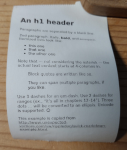

# Print Markdown files on Aliexpress Cat Printers

More info on the printers: https://github.com/jo-m/gocatprint

```bash
go build ./
sudo ./mdcatprint example.md
```

Requires the `wkhtmltoimage` binary in PATH.


